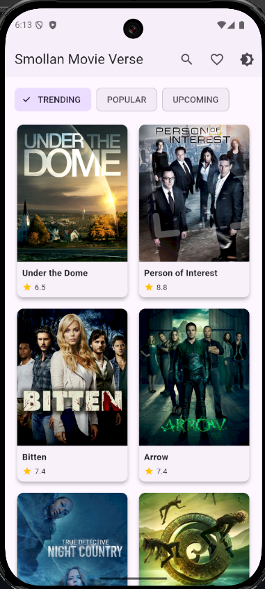
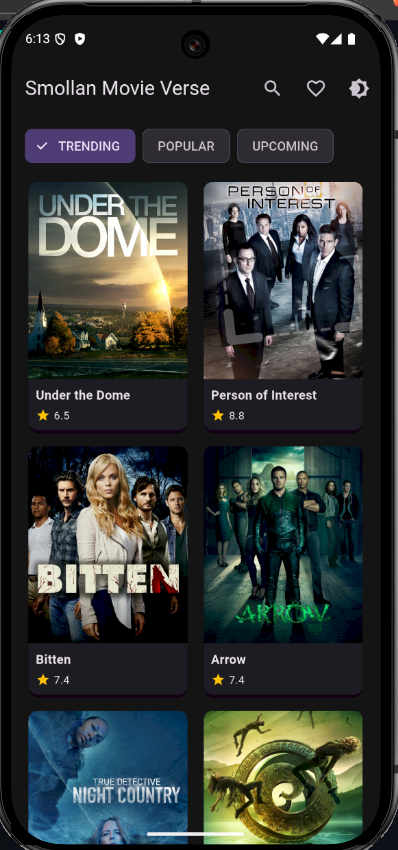
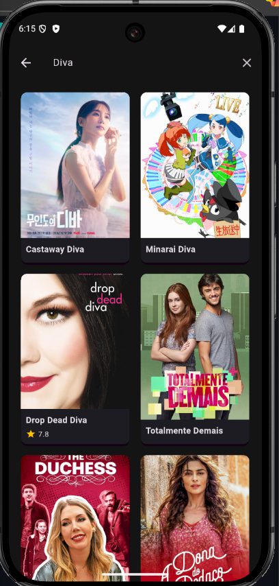
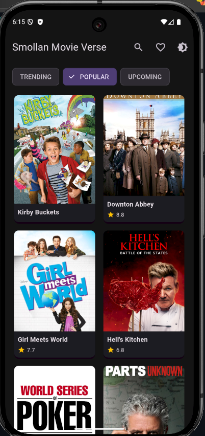

This interactive README template is ready for your Git repository. It highlights the core features, technical architecture, and installation steps, fulfilling all the requirements of the Flutter internship task.

-----

# Movie Verse 🎬

A robust Movie & TV Show Discovery App built using **Flutter**, emphasizing clean architecture, advanced state management, and offline persistence.

| Status | Tech Stack | API Source | State Management | Offline Storage |
| :--- | :--- | :--- | :--- | :--- |
| ✅ Complete | Flutter 3.x | TVMaze | Provider | Hive |

-----

## 🌟 Features Overview

### Core Functionality

| Feature | Description | Technical Implementation |
| :--- | :--- | :--- |
| **🔍 Dynamic Search** | Allows users to quickly search for any show by name, handling **`loading`**, **`success`**, and **`error`** states dynamically via **`UIState` Enums**. | `SearchProvider`, `TVMazeService`, `UIState` Enum |
| **❤️ Offline Favorites** | Users can **save and retrieve** their preferred shows for access even without an internet connection. | **Hive** Local Storage, `FavoritesProvider` |
| **⚡ Filter Discovery** | Home screen content can be instantly filtered by **Trending**, **Popular**, and **Upcoming** categories. | Custom **FilterCategory** Enum, `HomeProvider` |

### Advanced UI/UX & Architecture (Bonus Addons)

  * **Dark Mode Toggle:** A built-in feature using **`ThemeProvider`** that allows users to switch between light and dark themes instantly.
  * **Hero Animations:** Implemented on all show posters for a fluid transition from the list view to the details page.
  * **Responsiveness:** UI layouts adapt seamlessly to different screen sizes (phones and tablets).
  * **Clean Architecture:** Strict separation of `widgets`, `screens`, `models`, `providers`, and `services` for maximum scalability.

-----

## 🛠️ Technical Highlights

The project adheres to a clean, layered architecture focusing on maintainability and testability.

### 🧠 State Management: `Provider`

All major data flows are handled via Provider:

  * **`HomeProvider`**: Manages filtering logic and the initial API data fetching.
  * **`SearchProvider`**: Manages search queries and the dynamic `UIState` of the search results screen.
  * **`FavoritesProvider`**: Acts as the intermediary between the UI and the **Hive** local storage.

### 💾 Local Storage: `Hive`

  * Used to ensure **data persistence** for the Favorites list.
  * The `ShowModel` is registered with a `TypeAdapter` to allow custom object storage.

### 🔗 API Integration

  * Utilizes the **TVMaze API** for all show data.
  * Implemented endpoints: `/shows?page=...` (for filtering), `/search/shows?q=...` (for search), and `/shows/{id}` (for details).

### 🏷️ Enum Usage

Critical application logic relies on enums for clarity:

  * **`UIState`**: `initial`, `loading`, `success`, `error`.
  * **`FilterCategory`**: `trending`, `popular`, `upcoming`.

-----

## 🚀 Installation & Setup

To get a local copy up and running, follow these simple steps.

### Prerequisites

  * Flutter SDK (stable channel)
  * Dart 2.19+

### Folder Structure

TVSHOWS/

│
├── lib/
│   ├── models/
│   │   ├── show_model.dart
│   │   └── show_model.g.dart
│   ├── providers/
│   │   ├── favorites_provider.dart
│   │   ├── home_provider.dart
│   │   ├── search_provider.dart
│   │   └── theme_provider.dart
│   ├── screens/
│   │   ├── favorites_screen.dart
│   │   ├── home_screen.dart
│   │   ├── search_screen.dart
│   │   └── show_details_page.dart
│   ├── services/
│   │   ├── hive_service.dart
│   │   └── tvmaze_service.dart
│   ├── utils/
│   │   └── enums.dart
│   ├── widgets/
│   │   ├── filter_chips.dart
│   │   └── show_card.dart
│   └── main.dart
|


### Steps

1.  **Clone the Repository:**

    ```bash
    git clone https://github.com/AnantKumarSingh26/Digital-Verse.git
    ```

2.  **Install Dependencies:**

    ```bash
    flutter pub get
    ```

3.  **Run Code Generation (Crucial for Hive):**
    You must run the build runner to generate the necessary files for local storage.

    ```bash
    dart run build_runner build
    ```

4.  **Run the App:**

    ```bash
    flutter run
    ```

-----

## 📸 Screenshots & Demo

### 🌞 Light Mode & Dark Mode
| Light Mode | Dark Mode |
|------------|-----------|
|  |  |

### 🔍 Search & Filter
| Search Screen (Loading State) | Upcoming Filter |
|-------------------------------|-----------------|
|  |  |

### ❤️ Favorites
| Favorites Screen |
|------------------|
|  |
